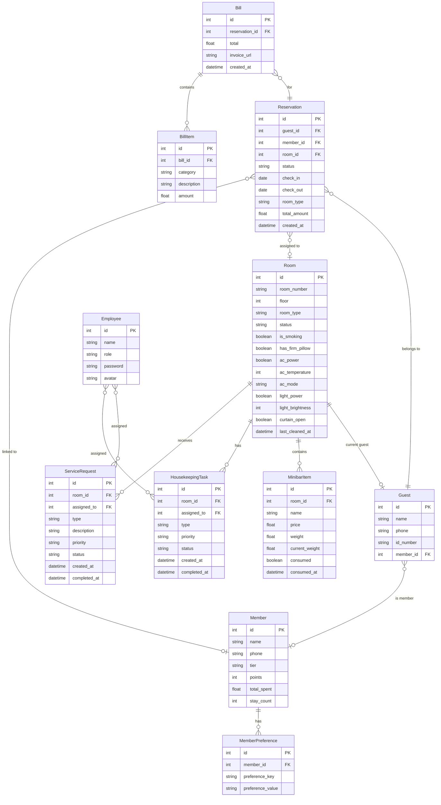

## 1. 架构设计

```mermaid
flowchart TB
    subgraph "前端层"
        "React SPA" --> "路由层 React Router"
        "路由层 React Router" --> "页面组件"
        "页面组件" --> "Zustand 状态管理"
        "页面组件" --> "ECharts 图表库"
    end

    subgraph "后端层"
        "Express API Server" --> "路由中间件"
        "路由中间件" --> "权限校验"
        "权限校验" --> "业务逻辑 Service"
        "业务逻辑 Service" --> "数据访问 Repository"
    end

    subgraph "数据层"
        "SQLite 数据库" --> "房间表"
        "SQLite 数据库" --> "预订表"
        "SQLite 数据库" --> "会员表"
        "SQLite 数据库" --> "服务请求表"
        "SQLite 数据库" --> "账单表"
    end

    subgraph "模拟IoT层"
        "客控模拟服务" --> "空调控制"
        "客控模拟服务" --> "灯光控制"
        "重力感应模拟" --> "迷你吧消费"
    end

    "前端层" -->|"HTTP/REST"| "后端层"
    "后端层" -->|"SQL"| "数据层"
    "后端层" -->|"指令"| "模拟IoT层"
```

## 2. 技术说明

- **前端**：React@18 + TypeScript + TailwindCSS@3 + Vite
- **初始化工具**：vite-init
- **后端**：Express@4 + TypeScript（ESM格式）
- **数据库**：SQLite（better-sqlite3），初始化时自动建表和Mock数据
- **状态管理**：Zustand
- **图表库**：ECharts（echarts + echarts-for-react）
- **路由**：React Router DOM v6
- **图标**：lucide-react
- **字体**：Playfair Display + DM Sans（Google Fonts）

## 3. 路由定义

| 路由 | 用途 | 权限 |
|------|------|------|
| /login | 登录页，角色选择与身份验证 | 公开 |
| /dashboard | 工作台首页，角色定制化概览 | 全部角色 |
| /rooms | 房态管理，房间网格与IoT控制 | 前台、客房主管、总经理 |
| /reservations | 预订列表，查看与管理预订 | 前台、总经理 |
| /reservations/new | 新建预订，智能排房 | 前台 |
| /checkin | 自助入住，人脸识别与发卡 | 前台 |
| /services | 客务服务，请求派工与迷你吧 | 服务员、前台、客房主管 |
| /housekeeping | 客房管理，保洁任务与扫码净房 | 服务员、客房主管 |
| /members | 会员中心，偏好管理与升级 | 前台、总经理 |
| /gm-dashboard | 总经理大屏，实时数据监控 | 总经理 |
| /reports | 报表中心，夜审报表与导出 | 总经理 |

## 4. API定义

### 4.1 认证相关

```typescript
// POST /api/auth/login
interface LoginRequest {
  employeeId: string;
  password: string;
  role: 'staff' | 'front_desk' | 'housekeeping_supervisor' | 'gm';
}

interface LoginResponse {
  token: string;
  user: {
    id: number;
    name: string;
    role: string;
    avatar: string;
  };
}

// GET /api/auth/me
interface UserInfo {
  id: number;
  name: string;
  role: string;
  avatar: string;
  permissions: string[];
}
```

### 4.2 房间管理

```typescript
// GET /api/rooms
interface Room {
  id: number;
  roomNumber: string;
  floor: number;
  roomType: 'standard' | 'deluxe' | 'suite' | 'presidential';
  status: 'available' | 'occupied' | 'cleaning' | 'maintenance' | 'reserved';
  isSmoking: boolean;
  hasFirmPillow: boolean;
  currentGuest?: Guest;
  iotDevices: {
    ac: { power: boolean; temperature: number; mode: string };
    light: { power: boolean; brightness: number };
    curtain: { open: boolean };
  };
  minibar: MinibarItem[];
  lastCleanedAt?: string;
}

// PUT /api/rooms/:id/status
interface UpdateRoomStatusRequest {
  status: Room['status'];
}

// PUT /api/rooms/:id/iot
interface UpdateIoTRequest {
  device: 'ac' | 'light' | 'curtain';
  settings: Record<string, any>;
}

// POST /api/rooms/:id/pre-arrival
interface PreArrivalRequest {
  acTemperature: number;
  lightBrightness: number;
}
```

### 4.3 预订管理

```typescript
// GET /api/reservations
interface Reservation {
  id: number;
  guestName: string;
  memberId?: number;
  phone: string;
  checkIn: string;
  checkOut: string;
  roomType: Room['roomType'];
  status: 'pending' | 'confirmed' | 'checked_in' | 'checked_out' | 'cancelled';
  preferences: string[];
  assignedRoomId?: number;
  createdAt: string;
}

// POST /api/reservations
interface CreateReservationRequest {
  guestName: string;
  memberId?: number;
  phone: string;
  checkIn: string;
  checkOut: string;
  roomType: Room['roomType'];
  preferences: string[];
}

// POST /api/reservations/:id/auto-assign
interface AutoAssignResponse {
  roomId: number;
  roomNumber: string;
  matchScore: number;
  matchDetails: { preference: string; matched: boolean }[];
}
```

### 4.4 入住/退房

```typescript
// POST /api/checkin
interface CheckInRequest {
  reservationId: number;
  faceVerified: boolean;
  keyType: 'card' | 'bluetooth';
}

interface CheckInResponse {
  success: boolean;
  roomNumber: string;
  keyInfo: { type: string; code: string };
}

// POST /api/checkout
interface CheckOutRequest {
  reservationId: number;
}

interface CheckOutResponse {
  success: boolean;
  totalBill: number;
  invoiceUrl: string;
  pointsEarned: number;
  memberUpgraded: boolean;
  newTier?: string;
}
```

### 4.5 客务服务

```typescript
// GET /api/service-requests
interface ServiceRequest {
  id: number;
  roomId: number;
  roomNumber: string;
  type: 'water' | 'towel' | 'cleaning' | 'maintenance' | 'other';
  description: string;
  priority: 'low' | 'medium' | 'high' | 'urgent';
  status: 'pending' | 'assigned' | 'in_progress' | 'completed';
  assignedTo?: { id: number; name: string; distance: string };
  createdAt: string;
  completedAt?: string;
}

// POST /api/service-requests
interface CreateServiceRequestReq {
  roomId: number;
  type: ServiceRequest['type'];
  description: string;
  priority: ServiceRequest['priority'];
}

// PUT /api/service-requests/:id/assign
interface AssignServiceRequestReq {
  staffId: number;
}

// POST /api/service-requests/auto-dispatch
interface AutoDispatchResponse {
  requestId: number;
  assignedStaff: { id: number; name: string; distance: string };
}
```

### 4.6 迷你吧

```typescript
// GET /api/rooms/:id/minibar
interface MinibarItem {
  id: number;
  name: string;
  price: number;
  weight: number;
  currentWeight: number;
  consumed: boolean;
  consumedAt?: string;
}

// POST /api/rooms/:id/minibar/consume
interface MinibarConsumeReq {
  itemId: number;
}
```

### 4.7 客房管理

```typescript
// POST /api/housekeeping/scan-clean
interface ScanCleanRequest {
  roomId: number;
  staffId: number;
  qualityScore?: number;
}

interface ScanCleanResponse {
  success: boolean;
  roomStatus: 'available';
  message: string;
}

// GET /api/housekeeping/tasks
interface HousekeepingTask {
  id: number;
  roomId: number;
  roomNumber: string;
  floor: number;
  type: 'checkout_clean' | 'daily_clean' | 'deep_clean';
  priority: 'low' | 'medium' | 'high';
  status: 'pending' | 'in_progress' | 'completed';
  assignedTo?: number;
  createdAt: string;
  completedAt?: string;
}
```

### 4.8 会员管理

```typescript
// GET /api/members
interface Member {
  id: number;
  name: string;
  phone: string;
  tier: 'silver' | 'gold' | 'platinum' | 'diamond';
  points: number;
  totalSpent: number;
  preferences: string[];
  stayCount: number;
  lastStay?: string;
  nextTierThreshold: number;
  progressToNextTier: number;
}

// PUT /api/members/:id/preferences
interface UpdatePreferencesReq {
  preferences: string[];
}
```

### 4.9 总经理大屏

```typescript
// GET /api/gm/dashboard
interface GMDashboardData {
  occupancy: {
    current: number;
    yesterday: number;
    trend: number[];
  };
  revpar: {
    current: number;
    yesterday: number;
    adr: number;
    trend: number[];
  };
  reviews: {
    average: number;
    platforms: { name: string; score: number; count: number }[];
    trend: number[];
    keywords: { word: string; weight: number }[];
  };
  energy: {
    total: number;
    byFloor: { floor: number; consumption: number }[];
    alerts: { message: string; level: string }[];
  };
  revenue: {
    roomRevenue: number;
    minibarRevenue: number;
    serviceRevenue: number;
    total: number;
  };
}

// GET /api/gm/night-audit
interface NightAuditReport {
  date: string;
  occupancy: number;
  totalRooms: number;
  occupiedRooms: number;
  availableRooms: number;
  roomRevenue: number;
  minibarRevenue: number;
  otherRevenue: number;
  totalRevenue: number;
  revpar: number;
  adr: number;
  checkIns: number;
  checkOuts: number;
  cancellations: number;
}
```

## 5. 服务器架构图

```mermaid
flowchart LR
    "Controller 层" --> "Service 层"
    "Service 层" --> "Repository 层"
    "Repository 层" --> "SQLite 数据库"
```

### 分层说明

- **Controller 层**：处理HTTP请求，参数校验，调用Service层
- **Service 层**：业务逻辑处理，智能排房算法，自动派工算法，会员升级判断
- **Repository 层**：数据访问，SQL查询，事务管理

## 6. 数据模型

### 6.1 数据模型定义



### 6.2 数据定义语言

```sql
CREATE TABLE employees (
    id INTEGER PRIMARY KEY AUTOINCREMENT,
    name TEXT NOT NULL,
    employee_id TEXT UNIQUE NOT NULL,
    role TEXT NOT NULL CHECK(role IN ('staff', 'front_desk', 'housekeeping_supervisor', 'gm')),
    password TEXT NOT NULL,
    avatar TEXT DEFAULT '',
    created_at DATETIME DEFAULT CURRENT_TIMESTAMP
);

CREATE TABLE rooms (
    id INTEGER PRIMARY KEY AUTOINCREMENT,
    room_number TEXT UNIQUE NOT NULL,
    floor INTEGER NOT NULL,
    room_type TEXT NOT NULL CHECK(room_type IN ('standard', 'deluxe', 'suite', 'presidential')),
    status TEXT NOT NULL DEFAULT 'available' CHECK(status IN ('available', 'occupied', 'cleaning', 'maintenance', 'reserved')),
    is_smoking BOOLEAN DEFAULT 0,
    has_firm_pillow BOOLEAN DEFAULT 0,
    ac_power BOOLEAN DEFAULT 0,
    ac_temperature INTEGER DEFAULT 24,
    ac_mode TEXT DEFAULT 'cool',
    light_power BOOLEAN DEFAULT 0,
    light_brightness INTEGER DEFAULT 80,
    curtain_open BOOLEAN DEFAULT 0,
    last_cleaned_at DATETIME,
    price_per_night REAL NOT NULL
);

CREATE TABLE members (
    id INTEGER PRIMARY KEY AUTOINCREMENT,
    name TEXT NOT NULL,
    phone TEXT UNIQUE NOT NULL,
    tier TEXT DEFAULT 'silver' CHECK(tier IN ('silver', 'gold', 'platinum', 'diamond')),
    points INTEGER DEFAULT 0,
    total_spent REAL DEFAULT 0,
    stay_count INTEGER DEFAULT 0,
    created_at DATETIME DEFAULT CURRENT_TIMESTAMP
);

CREATE TABLE member_preferences (
    id INTEGER PRIMARY KEY AUTOINCREMENT,
    member_id INTEGER NOT NULL REFERENCES members(id),
    preference_key TEXT NOT NULL,
    preference_value TEXT NOT NULL,
    UNIQUE(member_id, preference_key)
);

CREATE TABLE guests (
    id INTEGER PRIMARY KEY AUTOINCREMENT,
    name TEXT NOT NULL,
    phone TEXT NOT NULL,
    id_number TEXT UNIQUE NOT NULL,
    member_id INTEGER REFERENCES members(id),
    face_verified BOOLEAN DEFAULT 0,
    created_at DATETIME DEFAULT CURRENT_TIMESTAMP
);

CREATE TABLE reservations (
    id INTEGER PRIMARY KEY AUTOINCREMENT,
    guest_id INTEGER NOT NULL REFERENCES guests(id),
    member_id INTEGER REFERENCES members(id),
    room_id INTEGER REFERENCES rooms(id),
    status TEXT DEFAULT 'pending' CHECK(status IN ('pending', 'confirmed', 'checked_in', 'checked_out', 'cancelled')),
    check_in DATE NOT NULL,
    check_out DATE NOT NULL,
    room_type TEXT NOT NULL,
    preferences TEXT DEFAULT '[]',
    total_amount REAL DEFAULT 0,
    key_type TEXT,
    created_at DATETIME DEFAULT CURRENT_TIMESTAMP,
    updated_at DATETIME DEFAULT CURRENT_TIMESTAMP
);

CREATE TABLE service_requests (
    id INTEGER PRIMARY KEY AUTOINCREMENT,
    room_id INTEGER NOT NULL REFERENCES rooms(id),
    assigned_to INTEGER REFERENCES employees(id),
    type TEXT NOT NULL CHECK(type IN ('water', 'towel', 'cleaning', 'maintenance', 'other')),
    description TEXT,
    priority TEXT DEFAULT 'medium' CHECK(priority IN ('low', 'medium', 'high', 'urgent')),
    status TEXT DEFAULT 'pending' CHECK(status IN ('pending', 'assigned', 'in_progress', 'completed')),
    created_at DATETIME DEFAULT CURRENT_TIMESTAMP,
    completed_at DATETIME
);

CREATE TABLE minibar_items (
    id INTEGER PRIMARY KEY AUTOINCREMENT,
    room_id INTEGER NOT NULL REFERENCES rooms(id),
    name TEXT NOT NULL,
    price REAL NOT NULL,
    weight REAL NOT NULL,
    current_weight REAL NOT NULL,
    consumed BOOLEAN DEFAULT 0,
    consumed_at DATETIME
);

CREATE TABLE housekeeping_tasks (
    id INTEGER PRIMARY KEY AUTOINCREMENT,
    room_id INTEGER NOT NULL REFERENCES rooms(id),
    assigned_to INTEGER REFERENCES employees(id),
    type TEXT NOT NULL CHECK(type IN ('checkout_clean', 'daily_clean', 'deep_clean')),
    priority TEXT DEFAULT 'medium' CHECK(priority IN ('low', 'medium', 'high')),
    status TEXT DEFAULT 'pending' CHECK(status IN ('pending', 'in_progress', 'completed')),
    quality_score INTEGER,
    created_at DATETIME DEFAULT CURRENT_TIMESTAMP,
    completed_at DATETIME
);

CREATE TABLE bills (
    id INTEGER PRIMARY KEY AUTOINCREMENT,
    reservation_id INTEGER NOT NULL REFERENCES reservations(id),
    total REAL DEFAULT 0,
    invoice_url TEXT,
    created_at DATETIME DEFAULT CURRENT_TIMESTAMP
);

CREATE TABLE bill_items (
    id INTEGER PRIMARY KEY AUTOINCREMENT,
    bill_id INTEGER NOT NULL REFERENCES bills(id),
    category TEXT NOT NULL,
    description TEXT NOT NULL,
    amount REAL NOT NULL
);

-- 初始员工数据
INSERT INTO employees (name, employee_id, role, password, avatar) VALUES
('张小明', 'S001', 'staff', '123456', ''),
('李芳', 'S002', 'staff', '123456', ''),
('王建国', 'S003', 'staff', '123456', ''),
('赵丽', 'FD001', 'front_desk', '123456', ''),
('陈晨', 'FD002', 'front_desk', '123456', ''),
('刘伟', 'HS001', 'housekeeping_supervisor', '123456', ''),
('孙鹏', 'GM001', 'gm', '123456', '');

-- 初始房间数据（8层，每层5间）
INSERT INTO rooms (room_number, floor, room_type, status, is_smoking, has_firm_pillow, price_per_night) VALUES
('801', 8, 'presidential', 'available', 0, 1, 6888),
('802', 8, 'suite', 'available', 0, 1, 3888),
('803', 8, 'suite', 'occupied', 0, 0, 3888),
('804', 8, 'deluxe', 'available', 0, 1, 1888),
('805', 8, 'deluxe', 'available', 1, 0, 1888),
('701', 7, 'suite', 'available', 0, 1, 3888),
('702', 7, 'deluxe', 'occupied', 0, 0, 1888),
('703', 7, 'deluxe', 'available', 0, 1, 1888),
('704', 7, 'standard', 'cleaning', 0, 0, 988),
('705', 7, 'standard', 'available', 1, 0, 988),
('601', 6, 'deluxe', 'available', 0, 1, 1888),
('602', 6, 'deluxe', 'available', 0, 0, 1888),
('603', 6, 'standard', 'occupied', 0, 1, 988),
('604', 6, 'standard', 'available', 0, 0, 988),
('605', 6, 'standard', 'available', 1, 0, 988),
('501', 5, 'deluxe', 'available', 0, 1, 1888),
('502', 5, 'standard', 'available', 0, 0, 988),
('503', 5, 'standard', 'occupied', 1, 0, 988),
('504', 5, 'standard', 'available', 0, 1, 988),
('505', 5, 'standard', 'available', 0, 0, 988),
('401', 4, 'standard', 'available', 0, 0, 988),
('402', 4, 'standard', 'available', 0, 1, 988),
('403', 4, 'standard', 'available', 1, 0, 988),
('404', 4, 'standard', 'maintenance', 0, 0, 988),
('405', 4, 'standard', 'available', 0, 0, 988),
('301', 3, 'standard', 'available', 0, 0, 988),
('302', 3, 'standard', 'occupied', 0, 1, 988),
('303', 3, 'standard', 'available', 0, 0, 988),
('304', 3, 'standard', 'available', 1, 0, 988),
('305', 3, 'standard', 'available', 0, 0, 988),
('201', 2, 'standard', 'available', 0, 0, 988),
('202', 2, 'standard', 'available', 0, 1, 988),
('203', 2, 'standard', 'available', 0, 0, 988),
('204', 2, 'standard', 'available', 1, 0, 988),
('205', 2, 'standard', 'available', 0, 0, 988),
('101', 1, 'standard', 'available', 0, 0, 988),
('102', 1, 'standard', 'available', 0, 0, 988),
('103', 1, 'standard', 'available', 0, 0, 988),
('104', 1, 'standard', 'available', 1, 0, 988),
('105', 1, 'standard', 'available', 0, 0, 988);

-- 初始会员数据
INSERT INTO members (name, phone, tier, points, total_spent, stay_count) VALUES
('陈伟杰', '13800001001', 'diamond', 58000, 128000, 42),
('林晓雨', '13800001002', 'platinum', 32000, 56000, 28),
('王思远', '13800001003', 'gold', 15000, 28000, 15),
('张丽华', '13800001004', 'gold', 12000, 22000, 12),
('刘德明', '13800001005', 'silver', 5000, 8000, 5),
('赵小燕', '13800001006', 'silver', 2000, 3500, 3),
('黄志强', '13800001007', 'platinum', 28000, 48000, 22),
('周美玲', '13800001008', 'diamond', 62000, 145000, 48),
('吴建国', '13800001009', 'gold', 18000, 32000, 16),
('孙丽芳', '13800001010', 'silver', 3000, 5000, 4);

-- 会员偏好数据
INSERT INTO member_preferences (member_id, preference_key, preference_value) VALUES
(1, 'floor', 'high'), (1, 'smoking', 'non-smoking'), (1, 'pillow', 'firm'),
(2, 'floor', 'high'), (2, 'smoking', 'non-smoking'), (2, 'pillow', 'soft'),
(3, 'floor', 'low'), (3, 'smoking', 'non-smoking'), (3, 'pillow', 'firm'),
(7, 'floor', 'high'), (7, 'smoking', 'non-smoking'), (7, 'pillow', 'firm'),
(8, 'floor', 'high'), (8, 'smoking', 'non-smoking'), (8, 'pillow', 'soft');

-- 初始客人数据
INSERT INTO guests (name, phone, id_number, member_id) VALUES
('陈伟杰', '13800001001', '310101199001011234', 1),
('林晓雨', '13800001002', '310101199203045678', 2),
('王思远', '13800001003', '310101198505079012', 3),
('赵小燕', '13800001006', '310101199507083456', 6),
('黄志强', '13800001007', '310101198809101789', 7),
('孙丽芳', '13800001010', '310101199611122345', 10);

-- 初始预订数据
INSERT INTO reservations (guest_id, member_id, room_id, status, check_in, check_out, room_type, preferences, total_amount) VALUES
(1, 1, 803, 'checked_in', '2026-06-18', '2026-06-20', 'suite', '["high_floor","non_smoking","firm_pillow"]', 7776),
(5, 7, 702, 'checked_in', '2026-06-18', '2026-06-21', 'deluxe', '["high_floor","non_smoking","firm_pillow"]', 5664),
(3, 3, 603, 'checked_in', '2026-06-19', '2026-06-22', 'standard', '["low_floor","non_smoking","firm_pillow"]', 2964),
(2, 2, NULL, 'confirmed', '2026-06-20', '2026-06-23', 'deluxe', '["high_floor","non_smoking","soft_pillow"]', 5664),
(4, 6, 503, 'checked_in', '2026-06-17', '2026-06-19', 'standard', '["non_smoking"]', 1976);

-- 初始迷你吧数据（部分房间）
INSERT INTO minibar_items (room_id, name, price, weight, current_weight) VALUES
(803, '依云矿泉水', 38, 500, 500),
(803, '巴黎水', 42, 330, 0),
(803, '费列罗巧克力', 58, 200, 200),
(803, '坚果礼包', 68, 150, 150),
(702, '依云矿泉水', 38, 500, 0),
(702, '巴黎水', 42, 330, 330),
(702, '费列罗巧克力', 58, 200, 0),
(603, '依云矿泉水', 38, 500, 500),
(603, '巴黎水', 42, 330, 330),
(503, '依云矿泉水', 38, 500, 0),
(503, '坚果礼包', 68, 150, 150);

-- 初始服务请求数据
INSERT INTO service_requests (room_id, assigned_to, type, description, priority, status, created_at) VALUES
(803, 1, 'water', '客人需要两瓶矿泉水', 'medium', 'in_progress', '2026-06-19T08:30:00'),
(702, NULL, 'towel', '客人需要额外浴巾', 'low', 'pending', '2026-06-19T09:15:00'),
(603, 2, 'other', '客人需要多一个衣架', 'low', 'completed', '2026-06-19T07:00:00');

-- 初始保洁任务数据
INSERT INTO housekeeping_tasks (room_id, assigned_to, type, priority, status, created_at) VALUES
(704, 1, 'checkout_clean', 'high', 'in_progress', '2026-06-19T08:00:00'),
(503, 3, 'checkout_clean', 'high', 'pending', '2026-06-19T09:00:00');

-- 初始账单数据
INSERT INTO bills (reservation_id, total, invoice_url) VALUES
(1, 7776, '/invoices/INV20260618001.pdf'),
(2, 5664, NULL),
(3, 2964, NULL),
(5, 1976, '/invoices/INV20260617001.pdf');

INSERT INTO bill_items (bill_id, category, description, amount) VALUES
(1, 'room', '套房住宿2晚', 7776),
(2, 'room', '豪华客房住宿3晚', 5664),
(3, 'room', '标准客房住宿3晚', 2964),
(4, 'room', '标准客房住宿2晚', 1976);
```
